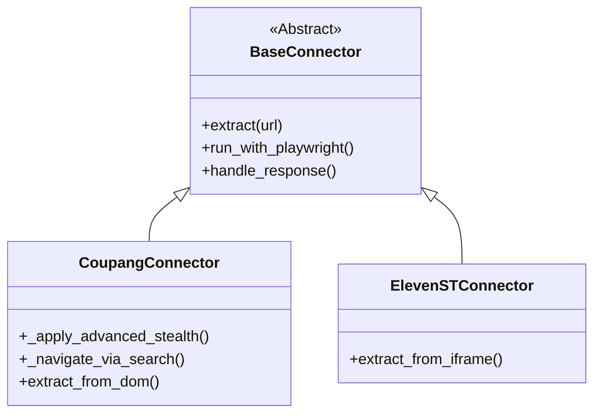

# 봇 차단 우회 시스템 기술 명세서 (Bot Bypass Technical Report)

이 문서는 'AI 상세페이지 생성기'의 핵심 엔진인 봇 차단 우회 시스템의 아키텍처, 구현 세부 사항 및 기술적 원리를 상세히 기술합니다.

---

## 1. 시스템 아키텍처 (System Architecture)

봇 우회 시스템은 **Base-Core-Market**의 3계층 상속 구조를 통해 모듈화되어 있습니다.



---

## 2. 핵심 기술 명세 (Technical Specifications)

### 2.1 커스텀 자바스크립트 인젝션 (Custom JS Injection)
가장 강력한 차단 기제인 `navigator.webdriver` 감지를 회피하기 위해 `add_init_script`를 사용합니다.

```javascript
// navigator.webdriver 속성 재정의
Object.defineProperty(navigator, 'webdriver', {
    get: () => undefined,
    configurable: true
});

// 하드웨어 핑거프린팅 랜덤화
Object.defineProperty(navigator, 'hardwareConcurrency', {
    get: () => [4, 8, 16][Math.floor(Math.random() * 3)]
});
```

### 2.2 페이크 헤드리스 모드 (Fake Headless Mode)
실제 브라우저를 띄우되(`headless: False`), 사용자의 시야에서 숨기기 위한 윈도우 좌표 트릭을 사용합니다.

- **작동 원리**: 브라우저를 띄우고 `window-position` 인자를 `-2400, -2400`으로 설정하여 모니터 가상 영역 밖에서 렌더링을 수행합니다.
- **장점**: 쇼핑몰 서버는 이를 '실제 UI를 가진 브라우저'로 인식하여 고도의 헤드리스 감지 로직을 통과합니다.

### 2.3 유입 경로 시뮬레이션 (Organic Referral Flow)
직접 URL 접근 시 발생하는 `Referrer: None` 문제를 해결하기 위해 다음의 비동기 흐름을 따릅니다.

1. **검색엔진 방문**: 구글/네이버 등 메이저 검색엔진 페이지 로드
2. **쿠키 생성**: 검색엔진 세션 쿠키 확보
3. **타겟 도메인 루팅**: 쇼핑몰 메인 페이지 접근 후 최소 2.5초 대기
4. **최종 URL 네비게이션**: 내부 링크 클릭 이벤트를 시뮬레이션 하여 데이터 요청

---

## 3. 리소스별 안정화 로직 (Data Stability)

### 3.1 XHR Response 인터셉션 (XHR Interception)
DOM 파싱의 불안정성을 극복하기 위해 Playwright의 `page.on("response")` 이벤트를 인터셉트합니다.

- **대상**: `.json`, `/api/`, `v1/` 등 API 엔드포인트
- **처리**: 응답 바디를 텍스트로 읽어 JSON으로 파싱 후 메모리에 캐싱하여 DOM 파싱 데이터와 병합(Merge)

### 3.2 이미지 바이너리 추출 및 검증
이미지 서버의 핫링크(Hotlinking) 방지를 최소화하기 위해 다음 로직을 순차 실행합니다.

1. **브라우저 컨텍스트 다운로드**: 브라우저가 이미 로드한 캐시로부터 데이터를 가져옴
2. **Curl Fallback**: 브라우저 쿠키와 UA를 그대로 복사하여 curl 명령어로 재시도
3. **Magic Number 검증**:
    - `0xFF 0xD8` (JPEG)
    - `0x89 0x50` (PNG)
    - 파일 시작 바이트를 대조하여 403 에러로 인한 HTML 페이지 다운로드 여부 식별

---

## 4. 사이트별 특화 구현 (Market Specifics)

### 4.1 쿠팡 (Coupang)
- **홈페이지 하이재킹**: 카테고리 페이지 직접 차단 시, 홈페이지로 우회 접근하여 메인 배너 및 추천 상품 섹션에서 상품 ID와 링크를 추출하는 동적 JS 로직 적용.

### 4.2 11번가 (11st)
- **iFrame 핸들링**: 상세 정보가 iFrame으로 분리된 구조를 고려하여, `page.frames` 리스트를 루프 돌며 내부 DOM 요소에 직접 접근하는 재귀적 파싱 기술 적용.

---

## 5. 향후 개선 사항 (Roadmap)

- **Proxy Rotation**: IP 차단 대비를 위한 유동 프록시 서버 연동 레이어 추가
- **OCR Integration**: 이미지 내 텍스트(정보고시 등) 추출을 위한 Tesseract/PaddleOCR 연동
- **Headless Detection Test**: 정기적인 `sannysoft.com` 핑거프린트 테스트 스케줄링

---
*본 문서는 기술적 기밀을 포함하고 있으므로 외부 유출 시 주의를 요합니다.*
